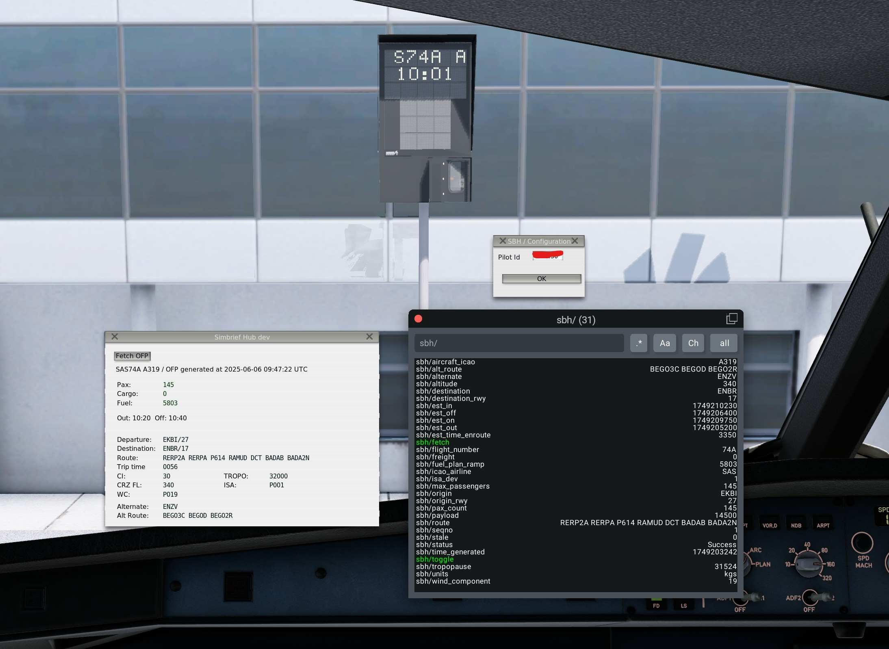

# simbrief_hub
A central resource of simbrief data for other plugins.

Download link: https://github.com/hotbso/simbrief_hub/releases. \
Support Discord: https://discord.gg/qhACbvWKvb

SBH automatically retrieves your current OFP during startup and populates various datarefs with OFP values.

There is a ui to review data or force another download.

Two "meta" datarefs reflect the status of OFP data:

```sbh/seqno``` : Sequence number of sucessful downloads for clients to track updates of OFP data.\
```sbh/stale``` : A download attempt failed. Hence data *may* be stale. You decide.



