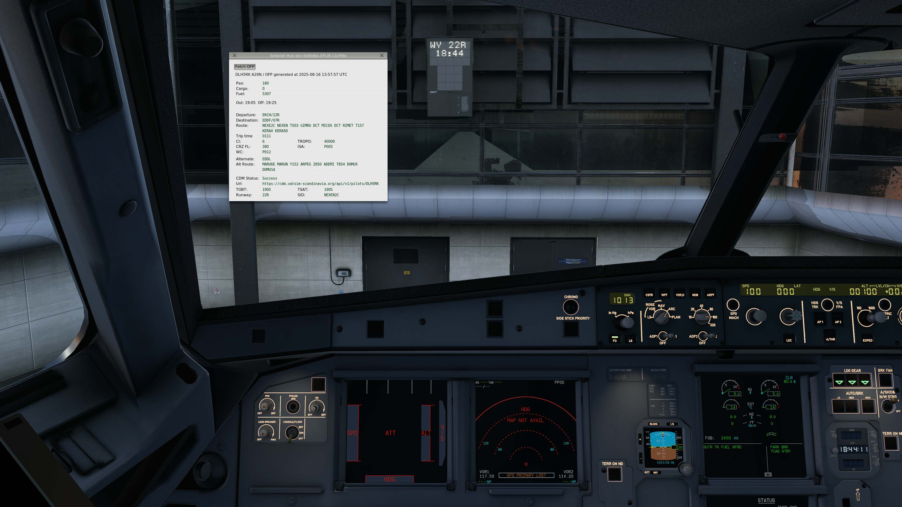

# simbrief_hub
A central resource of simbrief data for other plugins.

Download link: https://github.com/hotbso/simbrief_hub/releases. \
Support Discord: https://discord.gg/qhACbvWKvb

SBH automatically retrieves your current OFP during startup and populates various datarefs with OFP values (byte arrays).

There is a ui to review data or force another download.

Two "meta" datarefs (int) reflect the status of OFP data:

```sbh/seqno``` : Sequence number of sucessful downloads for clients to track updates of OFP data.\
```sbh/stale``` : A download attempt failed. Hence data *may* be stale. You decide.


## VATSIM CDM support
The plugin supports VATSIM CDM data for configured regions. Actually it pulls CDM data with the departure airport of your simbrief OFP and the callsign of your xPilot connection.

AutoDGS (>4.3.0) and openSAM (>4.2.1) pick up this information and display it on the VDGS during phases DEPARTURE and BOARDING.\
CDM data is refreshed every 90 seconds. So have some patience if does not show up immediately.



### Configuration
Unfortunately there is no central repository of available (= regional) CDM services. A configuration file ```simbrief_hub\cdm_cfg.default.json``` is installed and updated with the plugin.
```
Order matters!

The German server seems to be showcasing the vACDM product.
Hence it contains a lot of configuration data of airports that meanwhile have
their own server or run elsewhere. E.g. EGxx that runs on Spain.

Therefore Germany should come last.

!*&# -------- valid json enforced below this line -------- #&*!
{
    "servers": [
        {
            "name": "Spain",
            "protocol": "rpuig",
            "url": "https://aman.vatsimspain.es",
            "enabled": true
        },
        {
            "name": "Scandinavia",
            "protocol": "vacdm_v1",
            "url": "https://cdm.vatsim-scandinavia.org",
            "enabled": true
        },
        {
            "name": "France",
            "protocol": "vacdm_v1",
            "url": "https://cdm.vatsim.fr",
            "enabled": true
        },
        {
            "name": "Austria",
            "protocol": "vacdm_v1",
            "url": "https://vacdm.vacc-austria.org",
            "enabled": true
        },
        {
            "name": "China",
            "protocol": "vacdm_v1",
            "url": "https://vacdm.vatprc.net",
            "enabled": true
        },
        {
            "name": "Germany",
            "protocol": "vacdm_v1",
            "url": "https://app.vacdm.net",
            "enabled": true
        }
    ]
}

```
Instead of editing this one copy it to ```simbrief_hub\cdm_cfg.json``` and edit there. This file will never be changed by the update process.

If you've discovered additional servers or changes report them in the discord.
