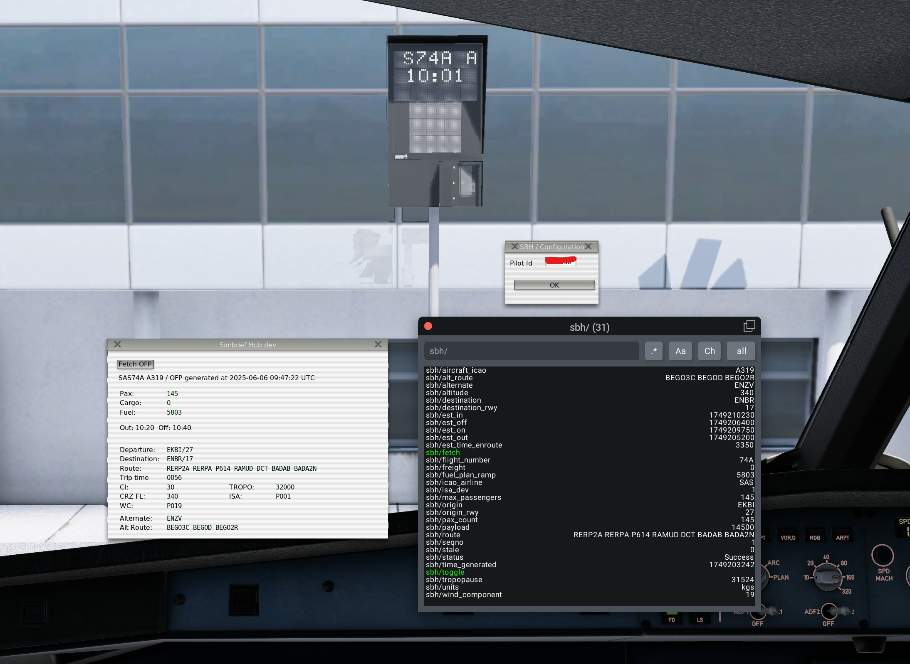
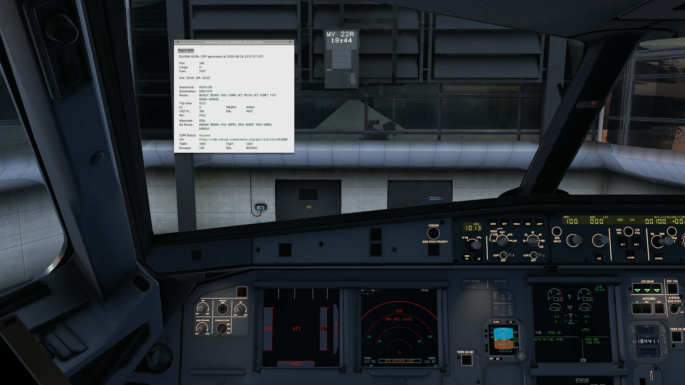
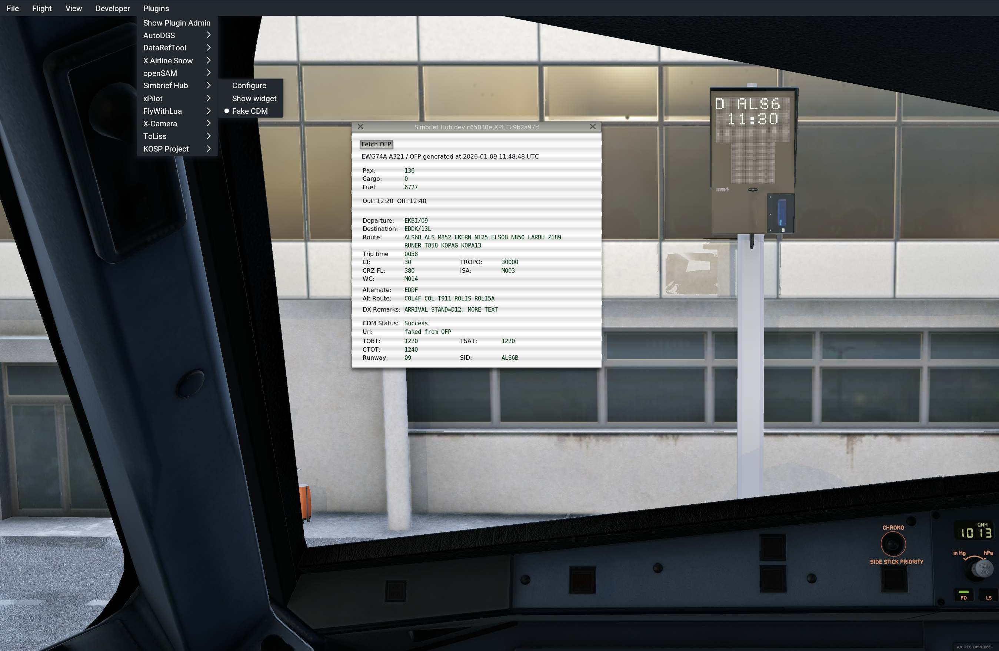

# simbrief_hub for X-Plane
A central resource of simbrief data for other plugins.

Download link: https://github.com/hotbso/simbrief_hub/releases/latest.

**General support is on Discord only:**  https://discord.gg/qhACbvWKvb \
**PMs, pings etc. will be ignored. Github issues will be closed without comment.**

Also refrain from submitting PRs with 'general improvements' generated by AI (e.g. VS Code Copilot).

## Functionality
SBH automatically retrieves your current OFP during startup and populates various datarefs with OFP values (byte arrays).

There is a ui to review data or force another download.

Two "meta" datarefs (int) reflect the status of OFP data:

```sbh/seqno``` : Sequence number of sucessful downloads for clients to track updates of OFP data.\
```sbh/stale``` : A download attempt failed. Hence data *may* be stale. You decide.




## VATSIM CDM support
The plugin supports VATSIM CDM data for configured regions. Actually it pulls CDM data with the departure airport of your simbrief OFP and the callsign of your xPilot connection.

AutoDGS (>4.3.0) and openSAM (>4.2.1) pick up this information and display it on the VDGS during phases DEPARTURE and BOARDING.\
CDM data is refreshed every 90 seconds. So have some patience if does not show up immediately.



### Configuration
Unfortunately there is no central repository of available (= regional) CDM services. A configuration file ```simbrief_hub\cdm_cfg.default.json``` is installed and updated with the plugin.
```
Order matters!

Most European airports are now served by vIFF.
Check https://viff-system.network/docs

Protocols:
- viff: vIFF, https://viff-system.network
- rpuig: legacy protocol, https://aman.vatsimspain.es
- vacdm_v1: legacy protocol used by France and China, https://cdm.vatsim.fr, https://vacdm.vatprc.net

During the migration phase viff should act as catch-all for airports not served by the legacy protocols and be last.

!*&# -------- valid json enforced below this line -------- #&*!
{
    "servers": [
        {
            "name": "Spain",
            "protocol": "rpuig",
            "url": "https://aman.vatsimspain.es",
            "enabled": false
        },
        {
            "name": "France",
            "protocol": "vacdm_v1",
            "url": "https://cdm.vatsim.fr",
            "enabled": true
        },
        {
            "name": "China",
            "protocol": "vacdm_v1",
            "url": "https://vacdm.vatprc.net",
            "enabled": true
        },
        {
            "name": "vIFF",
            "protocol": "viff",
            "url": "https://viff-system.network",
            "enabled": true
        }
    ]
}

```
Instead of editing this one copy it to ```simbrief_hub\cdm_cfg.json``` and edit there. This file will never be changed by the update process.

If you've discovered additional servers or changes report them in the discord.

## Fake CDM
If you don't fly on VATSIM or depart from airports that don't provide CDM you can fake CDM information for display on the VDGS.\
In this mode planned data from simbrief is taken as actual CDM provided data. If you later connect to VATSIM and/or real CDM data comes available fake data is replaced
automatically by downloaded CDM data.



